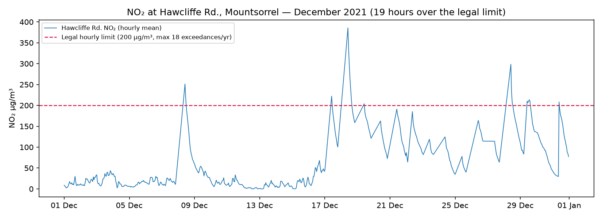
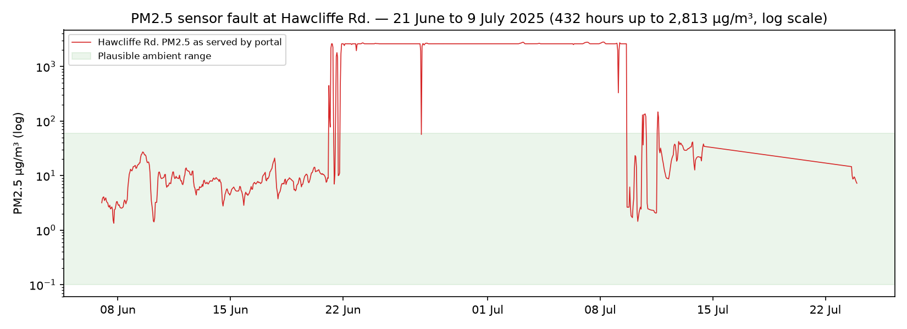
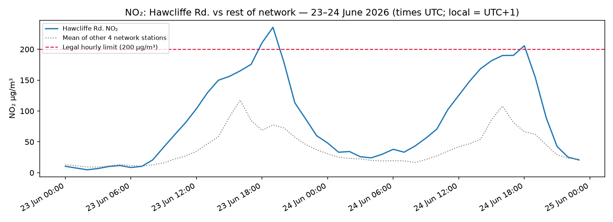
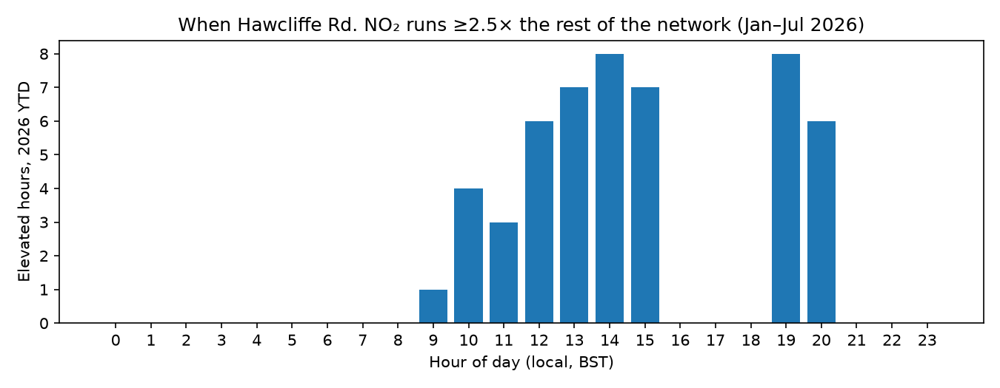

# Air quality at Hawcliffe Rd., Mountsorrel — observations from public monitoring data

**Prepared:** 4 July 2026
**Prepared by:** Simon Maddox (resident)
**Data sources:** Leicestershire County Council's public EarthSense air quality portal
(https://portal.earthsense.co.uk/LeicestershireCCPublic) — hourly-average data from
the council's five Zephyr® sensors, March 2021 – July 2026 (~46,000 hourly records);
the DustScanAQ monthly compliance reports for Mountsorrel Quarry for December 2021,
January 2022 and April 2026; and Charnwood Borough Council's LAQM Annual Status
Report 2024. The full extracted dataset and analysis code are available at
https://github.com/simonmaddox/dust-monitor.

## Summary

Analysis of the published data for the **Hawcliffe Rd., Mountsorrel** monitor shows
three things I believe warrant attention:

1. **December 2021: 19 hours over the legal NO₂ hourly limit** — more than the 18
   permitted per calendar year — recorded by an instrument whose NO₂ channel is
   not routinely reviewed by any process, during a period when the co-located
   instruments happened to be out of service.
2. **21 June – 9 July 2025: the monitor's PM2.5 sensor malfunctioned**, and the
   faulty readings (432 hours of 500–2,813 µg/m³) are still served by the public
   portal without a quality flag.
3. **2026: recurring large NO₂ spikes** — four hours over 200 µg/m³ so far this
   year, in a distinctive working-hours/early-evening pattern consistent with an
   intermittent combustion source near the monitor.

Each is supported by specific, timestamped data below, together with the checks I
ran to eliminate alternative explanations, and six requests — most of them small.

## The monitor and its context

The sensor behind all the data here is the **CBC Zephyr in the LCC depot at the
southern end of Hawcliffe Road** (LAQM site **CM5 "Mountsorrel"**), adjacent to the
quarry's own "Stn 9" sampler on the Mountsorrel Quarry boundary.

Two pieces of context shape everything that follows:

- **The site's NO₂ record is not routinely examined.** The quarry's DMMP compliance
  regime covers PM₁₀, PM2.5 and nuisance dust (no NO₂ appears in any of the monthly
  compliance reports reviewed), and CBC's Annual Status Report 2024 (Table A.1)
  registers CM5 as monitoring "PM₁₀, PM2.5" — while NO₂ *is* reported for the
  council's equivalent Loughborough Zephyr (CM6). This is an understandable scope —
  both frameworks were built around particulates from the quarry, and the
  Mountsorrel AQMA (declared 2011, revoked September 2024) covered PM₁₀ only — but
  it means the NO₂ findings below are probably being looked at here for the first
  time.
- **The monitor has close combustion neighbours**: the depot's own vehicle fleet,
  the quarry access, and the rail-loading area — useful context when interpreting
  its readings as representative of residential exposure on Hawcliffe Road.

Throughout, note that Zephyrs are **indicative** instruments, not reference-grade
analysers; individual values carry uncertainty and formal compliance is assessed by
reference methods. The patterns below are nonetheless strong and internally
consistent (the same instrument reads *below* its network neighbours on normal
days). All analysis excludes implausible readings (negative, NO₂ > 1,000,
PM2.5 > 500 µg/m³); times are UTC unless stated (local is UTC+1 in summer).

## Finding 1: December 2021 — NO₂ over the legal limit 19 times

The UK objective for NO₂ allows the 1-hour mean to exceed 200 µg/m³ at most
**18 times per calendar year**. Hawcliffe Rd. recorded **19 exceedance hours in
2021**, all in December — and the data only begins in March 2021:

| Date (UTC) | Hours over 200 | Peak |
|---|---|---|
| 8 Dec 2021 | 10:00, 11:00 | 251 |
| 17 Dec 2021 | 10:00 | 222 |
| 18 Dec 2021 | 10:00–15:00 (6 consecutive hours) | **386** |
| 19 Dec 2021 | 10:00 | 204 |
| 28 Dec 2021 | 10:00–12:00 | 299 |
| 29 Dec 2021 | 10:00–14:00 | 214 |
| 31 Dec 2021 | 09:00 | 208 |

Note the consistent 09:00–15:00 timing, continuing through weekends (18–19 Dec) and
the Christmas holiday week. Two further exceedance hours occurred on 4 January 2023
(258 and 242 µg/m³, again 09:00–10:00), then none until 2026.

**What the compliance record adds.** By unlucky coincidence, the DustScanAQ reports
for this period (26 Nov 2021 – 28 Jan 2022) record equipment problems affecting the
other instruments at this corner: the quarry weather station had a battery fault
throughout (rectified late February 2022), the quarry's Osiris PM monitor at Stn 9
was offline 15 Dec – 22 Jan (spanning six of the seven exceedance days), and the
council's Partisol returned no data for the period. The Zephyr was the only
instrument still recording — making its NO₂ record the sole surviving evidence.

The instruments that need no power did register something: **Stn 9's deposited dust
gauge exceeded its investigation trigger in both consecutive periods** —
188 mg/m²/day ("High", directional indication SW/W), then 127 ("Elevated").
DustScanAQ identified several candidate sources — the rail-loading area ("toast
rack"), PSV stocking grounds, the access road, or businesses along Granite Way —
though with the co-located instruments down, the specific source understandably
could not be determined at the time.

**Combined signature.** Sustained heavy diesel activity in the Stn 9/depot quarter:
daily from ~09:00–10:00 regardless of weekends or holidays, producing exceptional
dust *deposition*, low airborne particulate concentrations, and NO₂ to 386 µg/m³.
The archive's NO channel supports proximity: NO was present during the exceedance
hours (up to 124 µg/m³, NO/NO₂ ratio 0.1–0.4), indicating a combustion source
minutes upwind rather than kilometres; the coarse airborne fraction (PM₁₀ − PM2.5)
stayed under 5 µg/m³ during the NO₂ peaks — engines rather than mineral dust. The
NO₂ record now provides a fresh line of evidence for revisiting the source question
the 2021–22 dust investigations had to leave open.

## Finding 2: June–July 2025 — faulty PM2.5 data still published

From **06:00 UTC on 21 June 2025 to 15:00 UTC on 9 July 2025** the Hawcliffe Rd.
PM2.5 channel reported physically impossible values — **432 hourly readings between
500 and 2,813 µg/m³** across 19 days (normal levels here are 3–10 µg/m³).

These values are still served by the public portal and API without a quality flag;
averages computed from the raw feed are badly distorted (the station's 2025 annual
PM2.5 mean computes to ~142 µg/m³ raw vs ~9 with the fault excluded). The
professional users appear to handle this — the April 2026 compliance report's
12-month CBC Zephyr summary (89% valid data capture, PM2.5 mean 9.8) is consistent
with the fault period having been excluded — but anyone using the public feed
directly has no way to know. A flag or removal at source would fix this for
everyone.

## Finding 3: 2026 — recurring NO₂ spikes with a distinctive pattern

So far in 2026 Hawcliffe Rd. has recorded **four hours over the 200 µg/m³ hourly
limit** (within the current 18/year allowance, though already past the 3/year
allowance the EU's revised directive applies from 2030):

| Date | Time (UTC) | NO₂ |
|---|---|---|
| 25 May 2026 | 19:00 | 220 |
| 23 June 2026 | 18:00 | 211 |
| 23 June 2026 | 19:00 | **236** |
| 24 June 2026 | 18:00 | 206 |

The 23–24 June chart shows the signature: the whole network rises in the evening,
but Hawcliffe rises to **2.5–3× the average of the other four stations**. Hawcliffe
normally reads *below* its neighbours (median ratio 0.86), so these are episodic,
local events rather than a generally polluted location. The hours when Hawcliffe
runs far above the rest of the network cluster in working hours and early evening,
with none overnight:

## Alternative explanations tested

To avoid pointing this evidence in the wrong direction, I tested the obvious
alternatives against the five-year archive:

- **Stonehurst Farm car nights** (last Monday monthly, 5pm): of the 21 car-night
  evenings covered by the archive, 20 show ordinary readings; the single
  coincidence (25 May 2026) does not establish a pattern.
- **Stonehurst Christmas events** (annual): only December 2021 shows exceedances —
  Decembers 2022–2025 contain zero hours even above 100 µg/m³ — and an annual
  event cannot explain a one-off. (One minor localized PM2.5 event on the
  afternoon of 28 Dec 2025 — 26 µg/m³ vs a network mean of 2.5 — is consistent
  with wood smoke and noted for completeness.)
- **Quarry blasting** (typically ~12:30): plausibly contributes to the broad
  weekday midday elevation, but cannot explain the morning-anchored December 2021
  episodes or the 19:00–20:00 events of 2026. Hourly averaging also dilutes short
  blast-fume plumes roughly five-fold, so the quarry's own 15-minute Stn 9 data is
  the better instrument for that specific question.

What remains consistent with all the evidence: an intermittent combustion source
(vehicles or plant) operating close to the monitor on working-hours-plus-evenings
schedules — with the depot quarter, the rail-loading area and quarry plant the
natural candidates, distinguishable using records that already exist.

## Requests

1. **Cross-reference the quarry blast log** against the timestamped elevated hours
   (all timestamps are in this repository's data archive) — this would confirm or
   eliminate blast fume as a contributor to the midday pattern.
2. **Establish what operated in the depot / rail-loading quarter** during
   December 2021 – January 2022 (rail loading schedules, depot fleet and gritting
   records) and on the 2026 evening dates (25 May, 23–24 June, 19:00–21:00 local).
3. **Flag or remove the 21 June – 9 July 2025 PM2.5 data** in the public feed, and
   confirm the sensor's current condition.
4. **Revisit the Zephyr–Osiris comparison** raised in the January 2022 compliance
   report ("the Osiris may be underreporting PM2.5… will be investigated") — the
   April 2026 report shows the two instruments still differing by roughly a factor
   of two, and resolving which is nearer the truth would benefit everyone using
   either dataset.
5. **Consider adding the CM5 Zephyr's NO₂ channel** to the pollutants reported in
   the LAQM Annual Status Report, as is already done for the Loughborough Zephyr
   (CM6) — and, when interpreting CM5 data, taking account of the monitor's
   location within the working depot.
6. **Consider whether these findings justify reference-grade NO₂ monitoring**
   (e.g. a diffusion-tube survey) at or near this location, so that any future
   episode like December 2021 can be assessed against the objectives with
   compliance-grade data.

I'm happy to share the extracted dataset, the analysis code, or anything else
useful.
